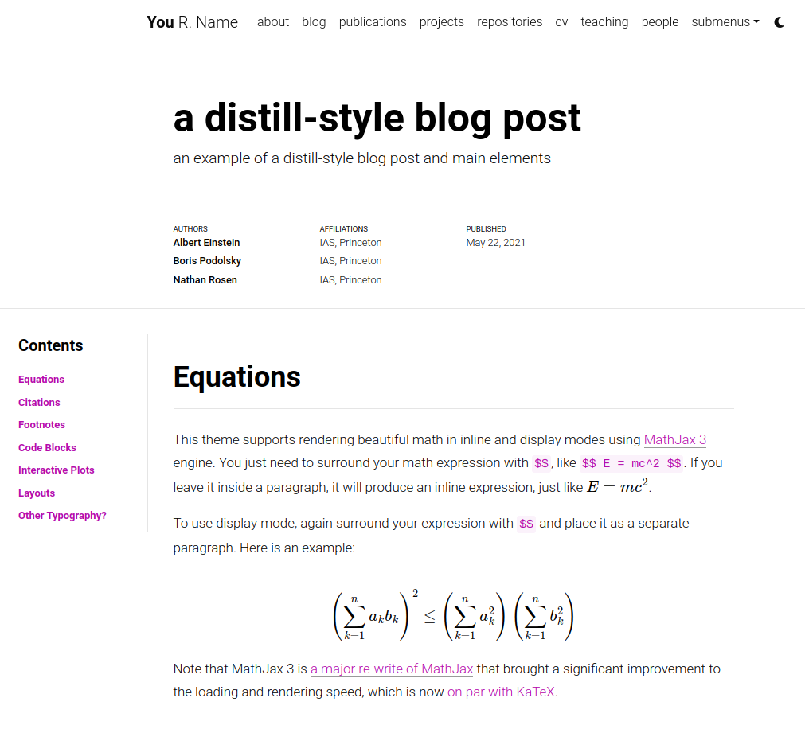

# Portfolio website

**A simple, clean, and responsive [Jekyll](https://jekyllrb.com/) theme for academics.**


## User community

The vibrant community of **al-folio** users is growing!
Academics around the world use this theme for their homepages, blogs, lab pages, as well as webpages for courses, workshops, conferences, meetups, and more.
Check out the community webpages below.
Feel free to add your own page(s) by sending a PR.

<table>
<tr>
<td>Academics</td>
<td>
<a href="https://martinbulla.github.io" target="_blank">★</a>
<a href="https://maruan.alshedivat.com" target="_blank">★</a>
<a href="https://www.cs.columbia.edu/~chen1ru/" target="_blank">★</a>
<a href="https://maithraraghu.com" target="_blank">★</a>
<a href="https://platanios.org" target="_blank">★</a>
<a href="https://otiliastr.github.io" target="_blank">★</a>
<a href="https://www.maths.dur.ac.uk/~sxwc62/" target="_blank">★</a>
<a href="https://jessachandler.com/" target="_blank">★</a>
<a href="https://mayankm96.github.io/" target="_blank">★</a>
<a href="https://markdean.info/" target="_blank">★</a>
<a href="https://kakodkar.github.io/" target="_blank">★</a>
<a href="https://sahirbhatnagar.com/" target="_blank">★</a>
<a href="https://spd.gr/" target="_blank">★</a>
<a href="https://jay-sarkar.github.io/" target="_blank">★</a>
<a href="https://aborowska.github.io/" target="_blank">★</a>
<a href="https://aditisgh.github.io/" target="_blank">★</a>
<a href="https://alexhaydock.co.uk/" target="_blank">★</a>
<a href="https://alixkeener.net/" target="_blank">★</a>
<a href="https://andreea7b.github.io/" target="_blank">★</a>
<a href="https://rishabhjoshi.github.io/" target="_blank">★</a>
<a href="https://sheelabhadra.github.io/" target="_blank">★</a>
<a href="https://giograno.me/" target="_blank">★</a>
<a href="https://immsrini.github.io/" target="_blank">★</a>
<a href="https://apooladian.github.io/" target="_blank">★</a>
<a href="https://chinmoy-dutta.github.io/" target="_blank">★</a>
<a href="https://liamcli.com/" target="_blank">★</a>
<a href="https://yoonholee.com/" target="_blank">★</a>
<a href="https://zrqiao.github.io/" target="_blank">★</a>
<a href="https://abstractgeek.github.io/" target="_blank">★</a>
<a href="https://www.compphys.de/" target="_blank">★</a>
<a href="https://julianstreyczek.github.io" target="_blank">★</a>
<a href="https://sdaza.com" target="_blank">★</a>
<a href="https://niweera.gq" target="_blank">★</a>
<a href="https://www.alihkw.com" target="_blank">★</a>
<a href="https://amirpourmand.ir" target="_blank">★</a>
<a href="https://scottleechua.github.io" target="_blank">★</a>
<a href="https://sk1y101.github.io" target="_blank">★</a>
<a href="https://yyang768osu.github.io" target="_blank">★</a>
<a href="https://veedata.github.io" target="_blank">★</a>
<a href="https://K-Wu.github.io" target="_blank">★</a>
<a href="https://amalawilson.com" target="_blank">★</a>
<a href="https://tirtharajdash.github.io" target="_blank">★</a>
<a href="https://carolinacarreira.github.io" target="_blank">★</a>
<a href="https://manandey.github.io" target="_blank">★</a>
<a href="https://johanneshoerner.github.io" target="_blank">★</a>
<a href="https://ioannismavromatis.com" target="_blank">★</a>
<a href="https://taidnguyen.github.io" target="_blank">★</a>
<a href="https://lbugnon.github.io" target="_blank">★</a>
<a href="https://joahannes.github.io" target="_blank">★</a>
<a href="https://dominikstrb.github.io" target="_blank">★</a>
<a href="https://tylerbarna.com" target="_blank">★</a>
<a href="https://daviddmc.github.io/" target="_blank">★</a>
<a href="https://andreaskuster.ch/" target="_blank">★</a>
<a href="https://ellisbrown.github.io/" target="_blank">★</a>
<a href="https://djherron.github.io/" target="_blank">★</a>
<a href="https://rodosingh.github.io/" target="_blank">★</a>
<a href="https://vdivakar.github.io/" target="_blank">★</a>
<a href="https://george-gca.github.io/" target="_blank">★</a>
<a href="https://bashirkazimi.github.io/" target="_blank">★</a>
<a href="https://dohaison.github.io/" target="_blank">★</a>
<a href="https://raphaaal.github.io/" target="_blank">★</a>
<a href="https://varuniyer.info/" target="_blank">★</a>
<a href="https://yukimasano.github.io/" target="_blank">★</a>
<a href="https://hashe037.github.io/" target="_blank">★</a>
<a href="https://wang-boyu.github.io/" target="_blank">★</a>
<a href="https://qingqingchen.info" target="_blank">★</a>
<a href="https://bajinsheng.github.io/" target="_blank">★</a>
<a href="https://www.silviofanzon.com/" target="_blank">★</a>
<a href="https://kaikaiyao.github.io/" target="_blank">★</a>
<a href="https://alchemz.github.io/" target="_blank">★</a>
<a href="https://samadamday.com/" target="_blank">★</a>
<a href="https://fanpu.io/" target="_blank">★</a>
<a href="https://abigalekim.github.io/" target="_blank">★</a>
<a href="https://lucasresck.github.io/" target="_blank">★</a>
<a href="https://users.wpi.edu/~lfichera/" target="_blank">★</a>
<a href="https://anmspro.github.io/" target="_blank">★</a>
<a href="https://berlyne.net/" target="_blank">★</a>
<a href="https://filippomazzoli.github.io/" target="_blank">★</a>
<a href="https://www.escontrela.me/" target="_blank">★</a>
<a href="https://raffaem.github.io/" target="_blank">★</a>
<a href="https://cbueth.de/" target="_blank">★</a>
<a href="https://kyleaoman.github.io/" target="_blank">★</a>
<a href="https://decwest.github.io/" target="_blank">★</a>
<a href="https://www.jedburkat.com" target="_blank">★</a>
<a href="https://hrzhang.me" target="_blank">★</a>
<a href="https://kudhru.github.io/" target="_blank">★</a>
<a href="https://mbarbetti.github.io/" target="_blank">★</a>
<a href="https://www.zhivotenko.com/" target="_blank">★</a>
<a href="https://giordanodaloisio.github.io/" target="_blank">★</a>
<a href="https://aadityaura.github.io/" target="_blank">★</a>
<a href="https://abhinav-mehta.github.io/" target="_blank">★</a>
<a href="https://shubhashisroydipta.com/" target="_blank">★</a>
<a href="https://astanziola.github.io" target="_blank">★</a>
<a href="https://tinkerer.in" target="_blank">★</a>
<a href="https://sam-bieberich.github.io/" target="_blank">★</a>
<a href="https://afraniomelo.github.io/en/" target="_blank">★</a>
<a href="https://jonaruthardt.github.io" target="_blank">★</a>
<a href="https://www.zla.app/" target="_blank">★</a>
<a href="https://stavros.github.io" target="_blank">★</a>
<a href="https://ericslyman.com" target="_blank">★</a>
<a href="https://ztjona.github.io/" target="_blank">★</a>
<a href="https://chrischoi314.github.io" target="_blank">★</a>
<a href="https://riccobelli.faculty.polimi.it" target="_blank">★</a>
<a href="https://kishanved.tech/" target="_blank">★</a>
<a href="https://abhilesh.github.io/" target="_blank">★</a>
<a href="https://jackjburnett.github.io/" target="_blank">★</a>
<a href="https://physics-morris.github.io/" target="_blank">★</a>
<a href="https://sraf.ir" target="_blank">★</a>
<a href="https://acad.garywei.dev/" target="_blank">★</a>
<a href="https://tonideleo.github.io/" target="_blank">★</a>
<a href="https://alonkellner.com/" target="_blank">★</a>
<a href="https://berylbir.github.io/" target="_blank">★</a>
<a href="https://thefermi0n.github.io/" target="_blank">★</a>
<a href="https://mingsun-kaust.github.io/" target="_blank">★</a>
<a href="https://hdocmsu.github.io/" target="_blank">★</a>
<a href="https://trandangtrungduc.github.io/" target="_blank">★</a>
<a href="https://kinghowler.github.io/" target="_blank">★</a>
<a href="https://anurye.github.io/" target="_blank">★</a>
<a href="https://charlie-xiao.github.io/" target="_blank">★</a>
<a href="https://giuseppeperelli.github.io/" target="_blank">★</a>
<a href="https://shlee-lab.github.io/" target="_blank">★</a>
<a href="https://devos50.github.io/" target="_blank">★</a>
<a href="https://kocikowski.com/" target="_blank">★</a>
<a href="https://vmooers.github.io/" target="_blank">★</a>
<a href="https://jpfonseca.github.io/" target="_blank">★</a>
<a href="https://dmitryryumin.github.io/" target="_blank">★</a>
<a href="https://alexiglad.github.io/" target="_blank">★</a>
</td>
</tr>
<tr>
<td>Labs</td>
<td>
<a href="https://www.haylab.caltech.edu/" target="_blank">★</a>
<a href="https://sjkimlab.github.io/" target="_blank">★</a>
<a href="https://systemconsultantgroup.github.io/scg-folio/" target="_blank">★</a>
<a href="https://decisionlab.ucsf.edu/" target="_blank">★</a>
<a href="https://programming-group.com/" target="_blank">★</a>
<a href="https://sailing-lab.github.io/" target="_blank">★</a>
<a href="https://inbt.jhu.edu/epidiagnostics/" target="_blank">★</a>
<a href="https://www.nuesl.org/" target="_blank">★</a>
<a href="https://big-culture.github.io/" target="_blank">★</a>
</td>
</tr>
<tr>
<td>Courses</td>
<td>
CMU PGM (<a href="https://sailinglab.github.io/pgm-spring-2019/" target="_blank">S-19</a>) <br>
CMU DeepRL (<a href="https://cmudeeprl.github.io/403_website/" target="_blank">S-21</a>, <a href="https://cmudeeprl.github.io/703website_f21/" target="_blank">F-21</a>, <a href="https://cmudeeprl.github.io/403website_s22/" target="_blank">S-22</a>, <a href="https://cmudeeprl.github.io/703website_f22/" target="_blank">F-22</a>, <a href="https://cmudeeprl.github.io/403website_s23/" target="_blank">S-23</a>, <a href="https://cmudeeprl.github.io/703website_f23/" target="_blank">F-23</a>) <br>
CMU MMML (<a href="https://cmu-multicomp-lab.github.io/mmml-course/fall2020/" target="_blank">F-20</a>, <a href="https://cmu-multicomp-lab.github.io/mmml-course/fall2022/" target="_blank">F-22</a>) <br>
CMU AMMML (<a href="https://cmu-multicomp-lab.github.io/adv-mmml-course/spring2022/" target="_blank">S-22</a>, <a href="https://cmu-multicomp-lab.github.io/adv-mmml-course/spring2023/" target="_blank">S-23</a>) <br>
CMU ASI (<a href="https://cmu-multicomp-lab.github.io/asi-course/spring2023/" target="_blank">S-23</a>) <br>
CMU Distributed Systems (<a href="https://andrew.cmu.edu/course/15-440/" target="_blank">S-24</a>)
</td>
</tr>
<tr>
<td>Conferences & workshops</td>
<td>
ICLR Blog Post Track (<a href="https://iclr-blogposts.github.io/2023/" target="_blank">2023</a>, <a href="https://iclr-blogposts.github.io/2024/about" target="_blank">2024</a>) <br>
ML Retrospectives (NeurIPS: <a href="https://ml-retrospectives.github.io/neurips2019/" target="_blank">2019</a>, <a href="https://ml-retrospectives.github.io/neurips2020/" target="_blank">2020</a>; ICML: <a href="https://ml-retrospectives.github.io/icml2020/" target="_blank">2020</a>) <br>
HAMLETS (NeurIPS: <a href="https://hamlets-workshop.github.io/" target="_blank">2020</a>) <br>
ICBINB (NeurIPS: <a href="https://i-cant-believe-its-not-better.github.io/" target="_blank">2020</a>, <a href="https://i-cant-believe-its-not-better.github.io/neurips2021/" target="_blank">2021</a>) <br>
Neural Compression (ICLR: <a href="https://neuralcompression.github.io/" target="_blank">2021</a>) <br>
Score Based Methods (NeurIPS: <a href="https://score-based-methods-workshop.github.io/" target="_blank">2022</a>)<br>
Images2Symbols (CogSci: <a href="https://images2symbols.github.io/" target="_blank"> 2022</a>) <br>
Medical Robotics Junior Faculty Forum (ISMR: <a href="https://junior-forum-ismr.github.io/" target="_blank"> 2023</a>)<br>
Beyond Vision: Physics meets AI (ICIAP: <a href="https://physicsmeetsai.github.io/beyond-vision/" target="_blank">2023</a>) <br>
Workshop on Diffusion Models (NeurIPS: <a href="https://diffusionworkshop.github.io/" target="_blank">2023</a>) <br>
Workshop on Structured Probabilistic Inference & Generative Modeling (ICML: <a href="https://spigmworkshop.github.io/" target="_blank">2023</a>, <a href="https://spigmworkshop2024.github.io/" target="_blank">2024</a>)
</td>
</tr>
</table>

## Getting started

Want to learn more about Jekyll? Check out [this tutorial](https://www.taniarascia.com/make-a-static-website-with-jekyll/). Why Jekyll? Read [Andrej Karpathy's blog post](https://karpathy.github.io/2014/07/01/switching-to-jekyll/)! Why write a blog? Read [Rachel Thomas blog post](https://medium.com/@racheltho/why-you-yes-you-should-blog-7d2544ac1045).

## Installing and Deploying

For installation and deployment details please refer to [INSTALL.md](INSTALL.md).

## Customizing

For customization details please refer to [CUSTOMIZE.md](CUSTOMIZE.md).

## Features

### Light/Dark Mode

This template has a built-in light/dark mode. It detects the user preferred color scheme and automatically switches to it. You can also manually switch between light and dark mode by clicking on the sun/moon icon in the top right corner of the page.

<p align="center">


</p>

---

### Layouts

**al-folio** comes with stylish layouts for pages and blog posts.

#### The iconic style of Distill

The theme allows you to create blog posts in the [distill.pub](https://distill.pub/) style:

[](https://alshedivat.github.io/al-folio/blog/2021/distill/)

For more details on how to create distill-styled posts using `<d-*>` tags, please refer to [the example](https://alshedivat.github.io/al-folio/blog/2021/distill/).

#### Full support for math & code

**al-folio** supports fast math typesetting through [MathJax](https://www.mathjax.org/) and code syntax highlighting using [GitHub style](https://github.com/jwarby/jekyll-pygments-themes). Also supports [chartjs charts](https://www.chartjs.org/), [mermaid diagrams](https://mermaid-js.github.io/mermaid/#/), and [TikZ figures](https://tikzjax.com/).

<p align="center">
<a href="https://alshedivat.github.io/al-folio/blog/2015/math/" target="_blank"></a>
<a href="https://alshedivat.github.io/al-folio/blog/2015/code/" target="_blank"></a>
</p>


### Other features

#### GitHub's repositories and user stats

**al-folio** uses [github-readme-stats](https://github.com/anuraghazra/github-readme-stats) and [github-profile-trophy](https://github.com/ryo-ma/github-profile-trophy) to display GitHub repositories and user stats on the `/repositories/` page.

[](https://alshedivat.github.io/al-folio/repositories/)

Edit the `_data/repositories.yml` and change the `github_users` and `github_repos` lists to include your own GitHub profile and repositories to the `/repositories/` page.

You may also use the following codes for displaying this in any other pages.

```html
<!-- code for GitHub users -->

<div class="repositories d-flex flex-wrap flex-md-row flex-column justify-content-between align-items-center">
    
</div>


<!-- code for GitHub trophies -->
  
<h4>{{ user }}</h4>

<div class="repositories d-flex flex-wrap flex-md-row flex-column justify-content-between align-items-center">
  
</div>
 

<!-- code for GitHub repositories -->

<div class="repositories d-flex flex-wrap flex-md-row flex-column justify-content-between align-items-center">
    
</div>

```

---

#### Theming

A variety of beautiful theme colors have been selected for you to choose from. The default is purple, but you can quickly change it by editing the `--global-theme-color` variable in the `_sass/_themes.scss` file. Other color variables are listed there as well. The stock theme color options available can be found at [\_sass/\_variables.scss](_sass/_variables.scss). You can also add your own colors to this file assigning each a name for ease of use across the template.


#### Code quality checks

Currently, we run some checks to ensure that the code quality and generated site are good. The checks are done using GitHub Actions and the following tools:

- [Prettier](https://prettier.io/) - check if the formatting of the code follows the style guide
- [lychee](https://lychee.cli.rs/) - check for broken links
- [Axe](https://github.com/dequelabs/axe-core) (need to run manually) - do some accessibility testing

We decided to keep `Axe` runs manual because fixing the issues are not straightforward and might be hard for people without web development knowledge.

## FAQ

For frequently asked questions, please refer to [FAQ.md](FAQ.md).


## License

The theme is available as open source under the terms of the [MIT License](https://github.com/alshedivat/al-folio/blob/main/LICENSE).

Originally, **al-folio** was based on the [\*folio theme](https://github.com/bogoli/-folio) (published by [Lia Bogoev](https://liabogoev.com) and under the MIT license). Since then, it got a full re-write of the styles and many additional cool features.
